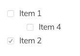

# Grav Markdown Task Lists Plugin

The **markdown-tasklists plugin** for [Grav](http://github.com/getgrav/grav) allows generation of task lists via markdown:



# Installation

This plugin is easy to install with GPM.

```
$ bin/gpm install markdown-tasklists
```

# Configuration

Simply copy the `user/plugins/markdown-tasklists/markdown-tasklists.yaml` into `user/config/plugins/markdown-tasklists.yaml` and make your modifications.

```
enabled: true
```

# Examples

To create a task list, preface list items with `[ ]`. To mark a task as complete, use `[x]`.

```
- [x] Finish my changes
- [ ] Push my commits to GitHub
- [ ] Open a pull request
```


